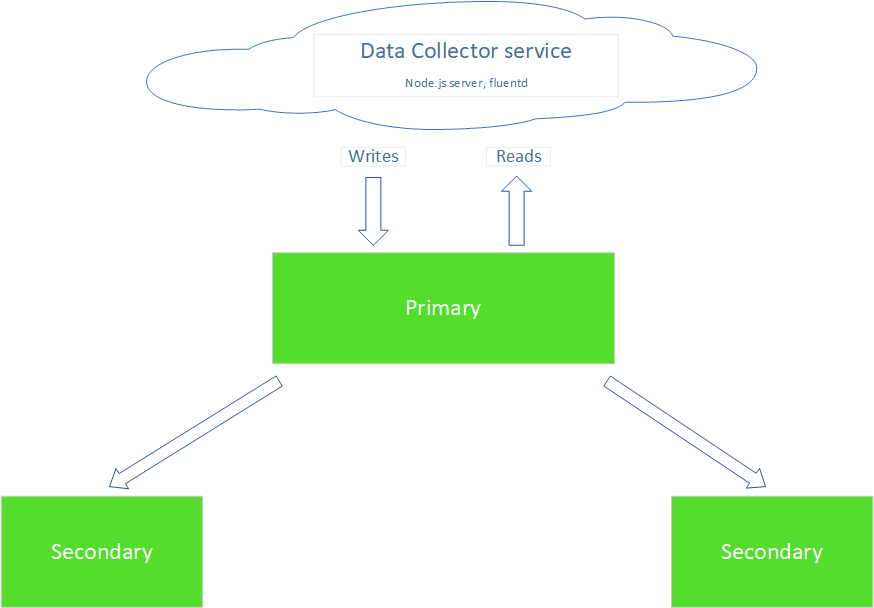

= Cloud Computing and Services
2021 Semester project

.Info
****
This project was developed as part of the 2021 semester Cloud Computing and Services lab. +
Collaborators: +
ΝΙΚΟΛΑΟΣ ΧΡΟΝΟΠΟΥΛΟΣ ΑΜ:131094, +
ΚΑΒΑΛΙΕΡΟΥ ΘΑΛΕΙΑ-ΕΛΠΙΣ ΑΜ:171009
****

=== Project description
.Data Collector Service
****
The project *_Data Collector Service_* is the default project of this semester's lab class. We aimed at creating a swarm of microservices that serve the purposes of _data collection_ and _presentation_. The project was accomplished with the help of the Swarmlab hybrid and venus.
****

=== Tools / services
****
Besides the http://docs.swarmlab.io/[Swarmlab] lab service, the following tools were used. +

* https://www.ansible.com/[ansible]
* https://www.fluentd.org/[fluentd]
* https://nodejs.org/en/[node.js]
* https://www.mongodb.com/[mongoDB]
* https://www.mongodb.com/[Vue.js]
* https://socket.io/[socket.IO]
[%hardbreaks]

To install every prerequisite included in _package.json_, run +
....
npm install
....
****

=== The project
==== First part : Deploying the network 
****
For this part, we used the _linux_ lab room of the _swarmlab_ service. By uploading a number of containers, we create a swarm of machines. These machines can collect data of any type, but for the testing purposes of this project they will collect data from _/tmp/log-in_ directory. The automated data collection is achieved with the tool _fluentd_. With _ansible_, we managed to orchestrate the swarm machines in order to act the same way.
[%hardbreaks]
From the Manager machine of the swarm, run (in the fluentd directory): 
....
make all
....
This will run the following scripts:
[%hardbreaks]
<1> fluentd.yml.sh +
With this script, the system will be updated and ansible will be downloaded in the Manager machine. Then, the ansible playbook _fluentd.yml_ will run so that the required settings will be installed on every other machine of the swarm.
<2> fluentd-config-update.yml.sh +
Run this script to set fluentd on every machine. The tool will collect data of the directory _/tmp/log-in_, where every machine of the swarm stores the intended data.
****
==== Second part: Storing data in a database
****
Although, storing data in files is enought for testing the tool, for the needs of our, total, project we connected the swarm with a _mongoDB_ replica. The databases was uploaded in the lab network via the _swarmlab_ service and it works as the following image indicates. +

[%hardbreaks]
In the _mongoDB_ replica network, we find 3 machines running a _mongoDB_ service. The Primary is the first tasked with storing data, incomming from the Data Collector service, and presenting them back. If Primary is not available, one of the other two will carry through the jobs needed.
[%hardbreaks]
From the Primary, or any other machine, of the _mongoDB_ replica network, follo the steps:
[%hardbreaks]
<1> mongo +
After connecting with the machine, run this command to enter the database's interface.
<2> use app_swarmlab +
Use this database, where data from the swarm will be stored in a collection.
<3> db.auth('app_swarmlab','app_swarmlab') +
Connect as admin to the database.
<4> db.logs.find({}).sort({_id:-1}) +
View logs in a descending order.
****

